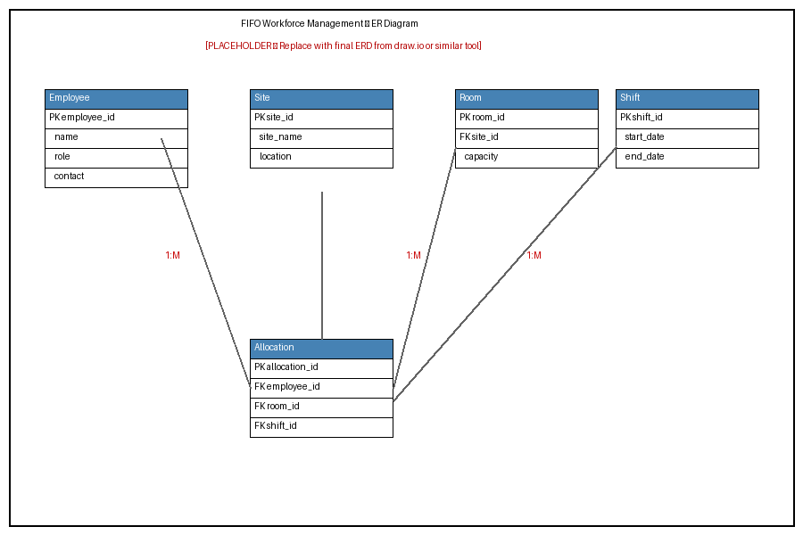

# INMT5526: Business Intelligence – Individual Assignment

**Unit:** INMT5526 – Business Intelligence, Semester 1, 2026  
**Institution:** University of Western Australia Business School – Management and Organisations  
**CRICOS:** 00126G | PRV12169, Australian University

---

## 1. Introduction

This report focuses on designing and implementing a database solution to address a business problem related to workforce and accommodation management in FIFO (Fly-In Fly-Out) operations. FIFO systems are commonly used in industries such as mining in Western Australia, where workers are transported to remote locations for specific time periods.

The main objective of this assignment is to apply database concepts learned in the first four topics of the unit, including entity-relationship modelling and SQL, to develop a structured solution. The report outlines the problem, explains the design process, presents the implementation and reflects on the effectiveness of the solution.

---

## 2. Background

FIFO operations involve managing multiple components at the same time, including employees, accommodation, shifts and site locations. In many organisations, this process is still handled using spreadsheets or basic systems, which can create several issues such as data duplication, errors and inefficiencies.

A key problem is the lack of a centralised and structured system to manage workforce allocation and accommodation. For example, employees may be assigned to overlapping shifts or rooms may be overbooked due to poor tracking. These issues can affect operational efficiency and increase costs.

Databases provide a more reliable solution because they allow data to be stored in a structured format and accessed efficiently. As discussed in the unit, databases are designed to organise data in a consistent way so that it can be retrieved and analysed to support decision-making (Ramakrishnan & Gehrke, 2003). Compared to spreadsheets, databases are more suitable when dealing with large amounts of data and multiple users.

The proposed solution is to develop a relational database system that stores information about employees, shifts, rooms and site locations. This system would allow managers to easily track which employees are assigned to which shifts and where they are staying.

This problem is worth solving because it improves coordination, reduces errors and supports better decision-making. From a business intelligence perspective, having structured and reliable data is essential for generating insights and making informed decisions (Negash, 2004).

---

## 3. Design

The database design was developed using entity-relationship modelling, which is used to represent real-world objects as entities and define the relationships between them. An entity refers to something we store data about, such as an employee or a site, while attributes describe the properties of that entity (Chen, 1976).

### Entities and Attributes

The following entities were identified for the system:

**Employee**
- employee_id (Primary Key)
- name
- role
- contact

**Site**
- site_id (Primary Key)
- site_name
- location

**Room**
- room_id (Primary Key)
- capacity
- site_id (Foreign Key → Site)

**Shift**
- shift_id (Primary Key)
- start_date
- end_date

**Allocation**
- allocation_id (Primary Key)
- employee_id (Foreign Key → Employee)
- room_id (Foreign Key → Room)
- shift_id (Foreign Key → Shift)

### Relationships

The relationships between entities were defined as follows:

- A site can contain multiple rooms (one-to-many)
- An employee can have multiple allocations (one-to-many)
- A room can be assigned to multiple allocations over time
- A shift can include multiple employees through allocations

These relationships reflect how FIFO operations function in reality and allow the system to store data efficiently.

### Design Justification

The design follows normalisation principles, meaning that data is organised into separate tables to reduce redundancy. Each table represents a single entity and relationships are managed through foreign keys.

This approach ensures data consistency and avoids duplication. For example, employee details are stored only once and referenced where needed, rather than being repeated multiple times.

Another important aspect of the design is planning before implementation. As highlighted in the lectures, designing the structure first helps avoid issues when writing SQL queries later.

### Use of Unit Concepts

The design applies several concepts from the unit:

- Entity-relationship modelling
- Primary and foreign keys
- Structured relational data
- Planning before implementation

These concepts were essential in ensuring that the database accurately represents the business problem. The ER diagram is provided in Appendix A.

---

## 4. Solution

The solution was implemented using SQL, which is used to create, manage and query relational databases. The implementation follows CRUD operations (Create, Read, Update and Delete), which form the basis of database systems (Elmasri & Navathe, 2016).

### Database and Table Creation

The SQL tables were created to match the entities and relationships defined in the ER diagram (see Appendix A). Foreign key constraints enforce referential integrity between tables, ensuring that no allocation can reference a non-existent employee, room or shift.

### Data Insertion

Sample data was inserted to demonstrate that the system functions correctly. Two employees, two sites, two rooms, two shifts and two allocations were added as initial test records.

### Queries

Several queries were written to retrieve meaningful data from the database:

1. A simple `SELECT` query retrieves all employee records.
2. A join query links Allocation, Employee, Room, Site and Shift tables to show each employee's assigned site and shift start date.
3. An aggregation query counts the number of rooms per site using `GROUP BY`.
4. An additional aggregation counts employees by role.

These queries demonstrate how structured data supports reporting and business intelligence. The full SQL statements are provided in Appendix B.

### Explanation

The SQL implementation demonstrates how data can be created, stored and retrieved efficiently. The use of joins allows multiple tables to be combined, while aggregation functions help generate useful insights.

This reflects how databases support business intelligence by transforming raw data into meaningful information.

---

## 5. Conclusion

Overall, the database solution successfully addresses the problem of managing FIFO workforce and accommodation. By organising data into structured tables and defining clear relationships, the system improves efficiency and reduces the likelihood of errors.

The solution meets the requirements by ensuring data consistency, enabling efficient queries and supporting decision-making. However, the system is still relatively basic and could be improved by adding features such as automated scheduling or integration with business intelligence tools.

One challenge during the process was ensuring that relationships between tables were correctly defined, particularly when working with foreign keys. This was resolved by carefully reviewing the ER design before implementation.

If this project were to be completed again, I would focus on expanding the system further and including more advanced queries to generate deeper insights.

---

## Appendix A: Design (ER Diagram)

> **Note:** The image below is a placeholder. Replace `er_diagram_placeholder.png` with the final ER Diagram exported from draw.io, Microsoft PowerPoint, or a similar diagramming tool before final submission.



*Figure 1. Entity-Relationship Diagram for the FIFO Workforce Management Database.*

---

## Appendix B: Implementation (SQL Statements)

### Database and Table Creation

```sql
CREATE DATABASE fifo_db;
USE fifo_db;

CREATE TABLE Employee (
  employee_id INT AUTO_INCREMENT,
  name        VARCHAR(100) NOT NULL,
  role        VARCHAR(50),
  contact     VARCHAR(100),
  PRIMARY KEY (employee_id)
);

CREATE TABLE Site (
  site_id   INT AUTO_INCREMENT,
  site_name VARCHAR(100) NOT NULL,
  location  VARCHAR(100),
  PRIMARY KEY (site_id)
);

CREATE TABLE Room (
  room_id  INT AUTO_INCREMENT,
  capacity INT CHECK (capacity > 0),
  site_id  INT,
  PRIMARY KEY (room_id),
  FOREIGN KEY (site_id) REFERENCES Site(site_id)
);

CREATE TABLE Shift (
  shift_id   INT AUTO_INCREMENT,
  start_date DATE NOT NULL,
  end_date   DATE NOT NULL,
  PRIMARY KEY (shift_id)
);

CREATE TABLE Allocation (
  allocation_id INT AUTO_INCREMENT,
  employee_id   INT,
  room_id       INT,
  shift_id      INT,
  PRIMARY KEY (allocation_id),
  FOREIGN KEY (employee_id) REFERENCES Employee(employee_id),
  FOREIGN KEY (room_id)     REFERENCES Room(room_id),
  FOREIGN KEY (shift_id)    REFERENCES Shift(shift_id)
);
```

### Data Insertion

```sql
INSERT INTO Employee (name, role, contact)
VALUES ('Alex Johnson', 'Engineer',   '123456'),
       ('Sarah Lee',    'Technician', '789101');

INSERT INTO Site (site_name, location)
VALUES ('Site A', 'WA'),
       ('Site B', 'WA');

INSERT INTO Room (capacity, site_id)
VALUES (2, 1),
       (1, 2);

INSERT INTO Shift (start_date, end_date)
VALUES ('2026-04-01', '2026-04-14'),
       ('2026-04-15', '2026-04-28');

INSERT INTO Allocation (employee_id, room_id, shift_id)
VALUES (1, 1, 1),
       (2, 2, 2);
```

### Queries

```sql
-- Retrieve all employees
SELECT * FROM Employee;

-- Join: employee name, site and shift start date
SELECT e.name,
       s.site_name,
       sh.start_date
FROM   Allocation a
JOIN   Employee e  ON a.employee_id = e.employee_id
JOIN   Room     r  ON a.room_id     = r.room_id
JOIN   Site     s  ON r.site_id     = s.site_id
JOIN   Shift    sh ON a.shift_id    = sh.shift_id;

-- Aggregation: total rooms per site
SELECT site_id,
       COUNT(room_id) AS total_rooms
FROM   Room
GROUP  BY site_id;

-- Aggregation: total employees per role
SELECT role,
       COUNT(*) AS total_employees
FROM   Employee
GROUP  BY role;
```

---

## References

Chen, P. P. (1976). The entity-relationship model—toward a unified view of data. *ACM Transactions on Database Systems, 1*(1), 9–36. https://doi.org/10.1145/320434.320440

Elmasri, R., & Navathe, S. B. (2016). *Fundamentals of database systems* (7th ed.). Pearson.

Negash, S. (2004). Business intelligence. *Communications of the Association for Information Systems, 13*(1), 177–195. https://doi.org/10.17705/1CAIS.01315

Ramakrishnan, R., & Gehrke, J. (2003). *Database management systems* (3rd ed.). McGraw-Hill.
