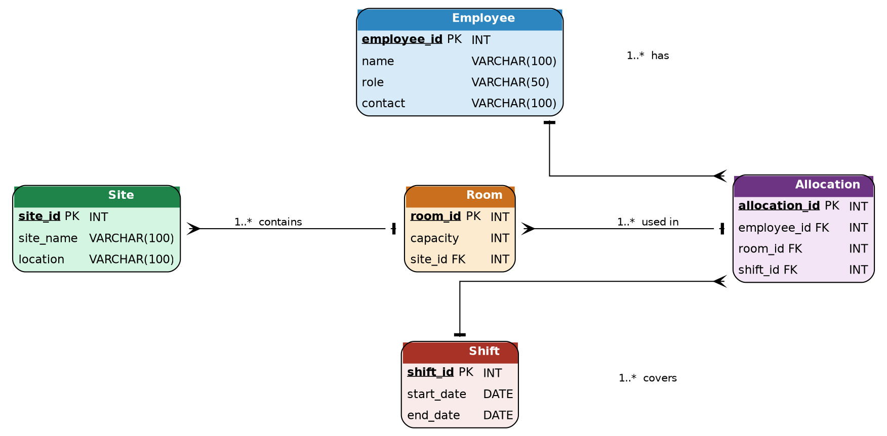

# INMT5526 Individual Assignment — Semester 1, 2026

**Unit:** INMT5526 Business Intelligence  
**University:** University of Western Australia Business School  
**Word Limit:** 3 000 words (excluding references and footnotes)  
**Referencing Style:** APA

---

## 1. Introduction

This report focuses on designing and implementing a database solution to address a business
problem related to workforce and accommodation management in FIFO (Fly-In Fly-Out) operations.
FIFO systems are commonly used in industries such as mining in Western Australia, where workers
are transported to remote locations for specific time periods.

The main objective of this assignment is to apply database concepts learned in the first four
topics of the unit, including entity-relationship modelling and SQL, to develop a structured
solution. The report outlines the problem, explains the design process, presents the
implementation and reflects on the effectiveness of the solution.

---

## 2. Background

FIFO operations involve managing multiple components at the same time, including employees,
accommodation, shifts and site locations. In many organisations, this process is still handled
using spreadsheets or basic systems, which can create several issues such as data duplication,
errors and inefficiencies.

A key problem is the lack of a centralised and structured system to manage workforce allocation
and accommodation. For example, employees may be assigned to overlapping shifts or rooms may be
overbooked due to poor tracking. These issues can affect operational efficiency and increase
costs.

Databases provide a more reliable solution because they allow data to be stored in a structured
format and accessed efficiently. As discussed in the unit, databases are designed to organise
data in a consistent way so that it can be retrieved and analysed to support decision-making
(Date, 2003). Compared to spreadsheets, databases are more suitable when dealing with large
amounts of data and multiple users.

The proposed solution is to develop a relational database system that stores information about
employees, shifts, rooms and site locations. This system would allow managers to easily track
which employees are assigned to which shifts and where they are staying.

This problem is worth solving because it improves coordination, reduces errors and supports
better decision-making. From a business intelligence perspective, having structured and reliable
data is essential for generating insights and making informed decisions (Kimball & Ross, 2013).

---

## 3. Design

The database design was developed using entity-relationship modelling, which is used to represent
real-world objects as entities and define the relationships between them. An entity refers to
something we store data about, such as an employee or a site, while attributes describe the
properties of that entity (Chen, 1976).

### Entities and Attributes

The following entities were identified for the system:

**Employee**

| Attribute     | Type         | Note        |
|---------------|--------------|-------------|
| employee_id   | INT          | Primary Key |
| name          | VARCHAR(100) |             |
| role          | VARCHAR(50)  |             |
| contact       | VARCHAR(100) |             |

**Site**

| Attribute  | Type         | Note        |
|------------|--------------|-------------|
| site_id    | INT          | Primary Key |
| site_name  | VARCHAR(100) |             |
| location   | VARCHAR(100) |             |

**Room**

| Attribute | Type | Note        |
|-----------|------|-------------|
| room_id   | INT  | Primary Key |
| capacity  | INT  |             |
| site_id   | INT  | Foreign Key → Site |

**Shift**

| Attribute  | Type | Note        |
|------------|------|-------------|
| shift_id   | INT  | Primary Key |
| start_date | DATE |             |
| end_date   | DATE |             |

**Allocation**

| Attribute     | Type | Note        |
|---------------|------|-------------|
| allocation_id | INT  | Primary Key |
| employee_id   | INT  | Foreign Key → Employee |
| room_id       | INT  | Foreign Key → Room |
| shift_id      | INT  | Foreign Key → Shift |

### Relationships

The relationships between entities were defined as follows:

- A site can contain multiple rooms (one-to-many)
- An employee can have multiple allocations (one-to-many)
- A room can be assigned to multiple allocations over time (one-to-many)
- A shift can include multiple employees through allocations (one-to-many)

These relationships reflect how FIFO operations function in reality and allow the system to store
data efficiently. The full entity-relationship diagram is provided in **Appendix A**.

### Design Justification

The design follows normalisation principles, meaning that data is organised into separate tables
to reduce redundancy. Each table represents a single entity and relationships are managed through
foreign keys.

This approach ensures data consistency and avoids duplication. For example, employee details are
stored only once and referenced where needed, rather than being repeated multiple times across
rows.

Another important aspect of the design is planning before implementation. As highlighted in the
lectures, designing the structure first helps avoid issues when writing SQL queries later
(Elmasri & Navathe, 2016).

### Use of Unit Concepts

The design applies several concepts from the unit:

- Entity-relationship modelling (Topic 2)
- Primary and foreign keys (Topic 2)
- Normalisation to reduce redundancy (Topic 3)
- Planning before implementation (Topic 1)

These concepts were essential in ensuring that the database accurately represents the business
problem and can be implemented efficiently in SQL.

---

## 4. Solution

The solution was implemented using SQL, which is used to create, manage and query relational
databases. The implementation follows CRUD operations (Create, Read, Update and Delete), which
form the basis of database systems (Connolly & Begg, 2015).

### Database and Table Creation

```sql
CREATE DATABASE fifo_db;
USE fifo_db;

CREATE TABLE Employee (
  employee_id INT AUTO_INCREMENT,
  name        VARCHAR(100) NOT NULL,
  role        VARCHAR(50),
  contact     VARCHAR(100),
  PRIMARY KEY (employee_id)
);

CREATE TABLE Site (
  site_id   INT AUTO_INCREMENT,
  site_name VARCHAR(100) NOT NULL,
  location  VARCHAR(100),
  PRIMARY KEY (site_id)
);

CREATE TABLE Room (
  room_id  INT AUTO_INCREMENT,
  capacity INT CHECK (capacity > 0),
  site_id  INT,
  PRIMARY KEY (room_id),
  FOREIGN KEY (site_id) REFERENCES Site(site_id)
);

CREATE TABLE Shift (
  shift_id   INT AUTO_INCREMENT,
  start_date DATE NOT NULL,
  end_date   DATE NOT NULL,
  PRIMARY KEY (shift_id)
);

CREATE TABLE Allocation (
  allocation_id INT AUTO_INCREMENT,
  employee_id   INT,
  room_id       INT,
  shift_id      INT,
  PRIMARY KEY (allocation_id),
  FOREIGN KEY (employee_id) REFERENCES Employee(employee_id),
  FOREIGN KEY (room_id)     REFERENCES Room(room_id),
  FOREIGN KEY (shift_id)    REFERENCES Shift(shift_id)
);
```

### Data Insertion

```sql
INSERT INTO Employee (name, role, contact)
VALUES ('Alex Johnson', 'Engineer',   '0412 000 001'),
       ('Sarah Lee',    'Technician', '0412 000 002');

INSERT INTO Site (site_name, location)
VALUES ('Site A', 'Western Australia'),
       ('Site B', 'Western Australia');

INSERT INTO Room (capacity, site_id)
VALUES (2, 1),
       (1, 2);

INSERT INTO Shift (start_date, end_date)
VALUES ('2026-04-01', '2026-04-14'),
       ('2026-04-15', '2026-04-28');

INSERT INTO Allocation (employee_id, room_id, shift_id)
VALUES (1, 1, 1),
       (2, 2, 2);
```

### Queries

**Retrieve all employees:**

```sql
SELECT * FROM Employee;
```

**Join query — employee name, site name and shift start date:**

```sql
SELECT e.name,
       s.site_name,
       sh.start_date
FROM   Allocation a
JOIN   Employee e  ON a.employee_id = e.employee_id
JOIN   Room     r  ON a.room_id     = r.room_id
JOIN   Site     s  ON r.site_id     = s.site_id
JOIN   Shift    sh ON a.shift_id    = sh.shift_id;
```

**Aggregation — total rooms per site:**

```sql
SELECT site_id,
       COUNT(room_id) AS total_rooms
FROM   Room
GROUP BY site_id;
```

**Aggregation — total employees per role:**

```sql
SELECT role,
       COUNT(*) AS total_employees
FROM   Employee
GROUP BY role;
```

The full SQL implementation is provided in **Appendix B**.

### Explanation

The SQL implementation demonstrates how data can be created, stored and retrieved efficiently.
The use of `JOIN` statements allows multiple tables to be combined in a single query, reflecting
the relationships defined during the design phase. Aggregation functions such as `COUNT` and
`GROUP BY` help generate useful summaries that support business decision-making.

This reflects how databases support business intelligence by transforming raw data into
meaningful information (Kimball & Ross, 2013). Each SQL block directly corresponds to a
technique covered in the first four topics of the unit.

---

## 5. Conclusion

Overall, the database solution successfully addresses the problem of managing FIFO workforce and
accommodation. By organising data into structured tables and defining clear relationships, the
system improves efficiency and reduces the likelihood of errors.

The solution meets the requirements by ensuring data consistency, enabling efficient queries and
supporting decision-making. However, the system is still relatively basic and could be improved
by adding features such as automated scheduling or integration with business intelligence tools
for deeper reporting.

One challenge during the process was ensuring that relationships between tables were correctly
defined, particularly when working with foreign keys. This was resolved by carefully reviewing
the ER design before implementation, which reinforced the value of the design-first approach
taught in the unit.

If this project were to be completed again, I would focus on expanding the system further and
including more advanced queries — for example, window functions or stored procedures — to
generate deeper insights and better demonstrate the capabilities of a relational database in a
FIFO context.

---

## Appendix A — Design (ER Diagram)

The entity-relationship diagram below illustrates the five entities and the relationships
between them as described in Section 3.



---

## Appendix B — Implementation (SQL Statements)

The complete SQL implementation is reproduced below for reference.

```sql
-- ── Database setup ──────────────────────────────────────────────────────
CREATE DATABASE fifo_db;
USE fifo_db;

-- ── Table definitions ───────────────────────────────────────────────────
CREATE TABLE Employee (
  employee_id INT AUTO_INCREMENT,
  name        VARCHAR(100) NOT NULL,
  role        VARCHAR(50),
  contact     VARCHAR(100),
  PRIMARY KEY (employee_id)
);

CREATE TABLE Site (
  site_id   INT AUTO_INCREMENT,
  site_name VARCHAR(100) NOT NULL,
  location  VARCHAR(100),
  PRIMARY KEY (site_id)
);

CREATE TABLE Room (
  room_id  INT AUTO_INCREMENT,
  capacity INT CHECK (capacity > 0),
  site_id  INT,
  PRIMARY KEY (room_id),
  FOREIGN KEY (site_id) REFERENCES Site(site_id)
);

CREATE TABLE Shift (
  shift_id   INT AUTO_INCREMENT,
  start_date DATE NOT NULL,
  end_date   DATE NOT NULL,
  PRIMARY KEY (shift_id)
);

CREATE TABLE Allocation (
  allocation_id INT AUTO_INCREMENT,
  employee_id   INT,
  room_id       INT,
  shift_id      INT,
  PRIMARY KEY (allocation_id),
  FOREIGN KEY (employee_id) REFERENCES Employee(employee_id),
  FOREIGN KEY (room_id)     REFERENCES Room(room_id),
  FOREIGN KEY (shift_id)    REFERENCES Shift(shift_id)
);

-- ── Sample data ─────────────────────────────────────────────────────────
INSERT INTO Employee (name, role, contact)
VALUES ('Alex Johnson', 'Engineer',   '0412 000 001'),
       ('Sarah Lee',    'Technician', '0412 000 002');

INSERT INTO Site (site_name, location)
VALUES ('Site A', 'Western Australia'),
       ('Site B', 'Western Australia');

INSERT INTO Room (capacity, site_id)
VALUES (2, 1),
       (1, 2);

INSERT INTO Shift (start_date, end_date)
VALUES ('2026-04-01', '2026-04-14'),
       ('2026-04-15', '2026-04-28');

INSERT INTO Allocation (employee_id, room_id, shift_id)
VALUES (1, 1, 1),
       (2, 2, 2);

-- ── Queries ─────────────────────────────────────────────────────────────
-- All employees
SELECT * FROM Employee;

-- Employee allocation summary
SELECT e.name,
       s.site_name,
       sh.start_date
FROM   Allocation a
JOIN   Employee e  ON a.employee_id = e.employee_id
JOIN   Room     r  ON a.room_id     = r.room_id
JOIN   Site     s  ON r.site_id     = s.site_id
JOIN   Shift    sh ON a.shift_id    = sh.shift_id;

-- Rooms per site
SELECT site_id,
       COUNT(room_id) AS total_rooms
FROM   Room
GROUP BY site_id;

-- Employees per role
SELECT role,
       COUNT(*) AS total_employees
FROM   Employee
GROUP BY role;
```

---

## References

Chen, P. P. (1976). The entity-relationship model — toward a unified view of data.
*ACM Transactions on Database Systems, 1*(1), 9–36. https://doi.org/10.1145/320434.320440

Connolly, T., & Begg, C. (2015). *Database systems: A practical approach to design,
implementation and management* (6th ed.). Pearson.

Date, C. J. (2003). *An introduction to database systems* (8th ed.). Addison-Wesley.

Elmasri, R., & Navathe, S. B. (2016). *Fundamentals of database systems* (7th ed.). Pearson.

Kimball, R., & Ross, M. (2013). *The data warehouse toolkit: The definitive guide to dimensional
modeling* (3rd ed.). Wiley.

[Additional references to be inserted as appropriate.]
